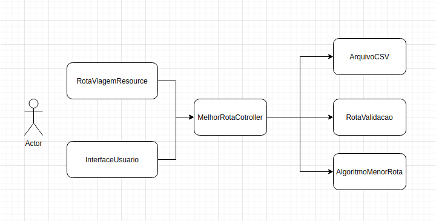
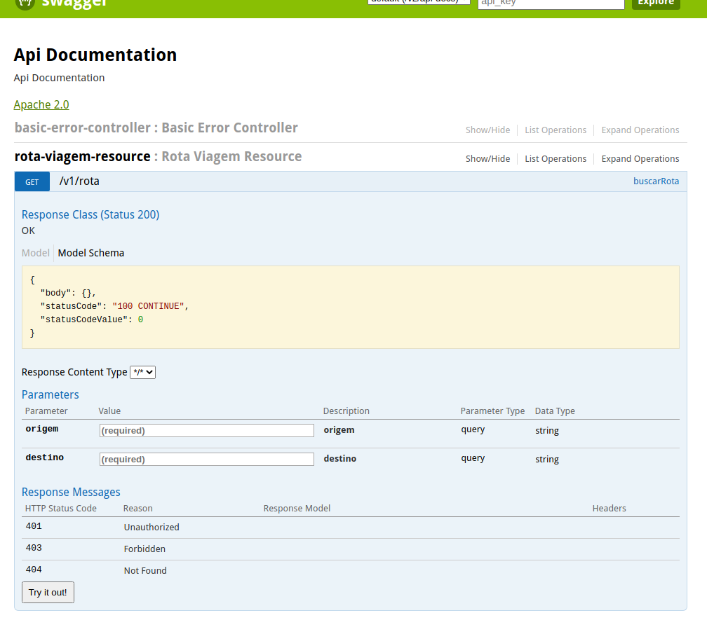

# Calcular a rota de viagem mais em conta

<!--ts-->
* [Descrição do projeto](##Descrição do projeto)
* [Algoritmo utlizado para resoluçao do problema](##Algoritmo Dijkstra)
* [Arquitetura](##Arquitetura)
* [Como executar](##Como Executar)
    * [Pré Requisitos](##Pre requisitos)
    * [Swagger](##Swagger)
    * [REST](##Iteração REST)
* [Testes](#Testes)
* [Consideraçoes Finais](#Consideraçoes Finais)
<!--te-->


##Descrição do projeto
Este projeto tem por objeto calcular menor custo entre duas rotas, nao considerando 
o numero de conexoes somente o custo.

##Algoritmo Dijkstra
Para resolução técnica deste problema foi utilizado o Algoritmo de Dijkstra
que objetiva solucionar o caminho mais curto num grafo dirigido com arestas
de peso não negativo.


##Arquitetura
A arquitetura do projeto levou em cosideração o requisito que deveria ser possivel 
ter mais de uma forma de iteração com a API (shell e Rest).

<b>RotaViagemResource</b> - Onde são expostas as interfaces de serviços REST.

<b>InterfaceUsuario</b> - Camada onde todas iteraçoes com usuario acontece.

<b>MelhorRotaController</b> - Orquestra as requisiçoes da camadas de iteraçao com nossa
camadas especialidas da API (Bussines).

<b>RotaValidacao</b> - Camada que centraliza as validacoes necessarias.

<b>AlgoritmoMenorRota</b> - Camada com a regra de negocio mais complexa da solução.

<b>ArquivoCSV</b> - Camada que manipula o arquivo leitura/escrita.

Está estrutura foi pensada justamente pensando em diminuir o acoplamento entre camadas 
(iteração com usuario, contrato de serviços) devem ser totalmente desacoplado das camadas que 
possuem um papel incomum e especialidado dentro do contexto de negócio.



```
OBSERVAÇÃO
O projeto foi escrito em liguagem JAVA por facilidade de sintaxe do autor.
E codigo escrito ligua portuguesa por se tratar de uma projeto BR, porém é
um assunto polemico que divide a comunidade.
```
##Pré requisitos
- Java 11
- Maven 3.0.5+

##Como Executar
Após clonar o projeto
```sh
cd rota-viagem
mvn clean install
```
Execute o programa passando por parâmetro um caminho válido de um csv contendo as rotas.
```sh
mvn spring-boot:run -Dspring-boot.run.arguments=--arquivo=<localização do arquivo>
```

##Swagger
Caso queria visualizar o arquivo de swagger
```sh
http://localhost:8080/swagger-ui.html
```


##Iteração REST

- Consulta melhor rota
```sh
curl --location --request GET 'http://localhost:8080/v1/rota?origem=GRU&destino=CDG'
```
- Adiciona rota
```sh
curl --location --request POST 'http://localhost:8080/v1/rota' \
--header 'Content-Type: application/json' \
--data-raw '{
"origem": "GRU",
"destino": "COG",
"valor": 10
}'
```
##Testes
Para criar todos os testes do programa, foram utilizados o Mockito e JUnit.
```
Ficou de TODO, teste de integração (serviços) com REST Assured
```

Para executar todos os testes do programa, execute:
```sh
mvn test
```
##Consideraçoes Finais
Espero que se divirtam corrigindo está avaliação com mesmo impeto, que me
dediquei a faze-la. Apesar do pouco tempo que tive!